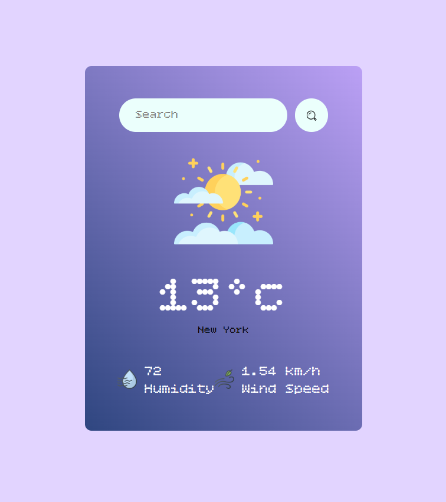

#  React Weather Dashboard

A modern, real-time weather application built with **React.js** and **Vite**. This project fetches live data from the **OpenWeatherMap API** to provide current weather conditions, humidity, and wind speeds for any city worldwide.

---

## Project Screenshot

* Live weather dashboard showing real-time data and dynamic condition icons.




---

##  Tech Stack

* **Frontend:** React.js (Functional Components & Hooks)
* **API:** OpenWeatherMap (REST API)
* **Environment:** Vite + ES6 JavaScript
* **Styling:** Custom CSS3 (Flexbox & Dynamic Icons)

---

##  Key Features

* **Live Data Fetching:** Uses `async/await` and the Fetch API to retrieve real-time weather stats.
* **Dynamic UI:** Automatically updates weather icons (Clear, Clouds, Rain, etc.) based on the API response.
* **Search Logic:** Implemented using `useRef` for efficient, non-re-rendering input handling.
* **Secure Architecture:** Uses `.env` variables to keep API credentials private and secure.

---

##  What I Learned

* **Live Data Fetching:** Uses `async/await` and the Fetch API to retrieve real-time weather stats.
* **Error Handling:** Managing "City Not Found" scenarios and empty search states to improve UX.
* **Data Modeling:** Parsing complex JSON objects from external APIs into usable React state.
* **Clean Architecture:** Organizing components and assets for better maintainability.

---

##  How to Run Locally

1. **Clone the repository**
```bash
git clone

```

2. **Install dependencies**

```bash
npm install

```

3. **Set up Environment Variables**
Create a `.env` file in the root directory and add your API key:

```env
VITE_APP_ID=your_openweather_api_key_here

```

4. **Start the development server**

```bash
npm run dev

```
